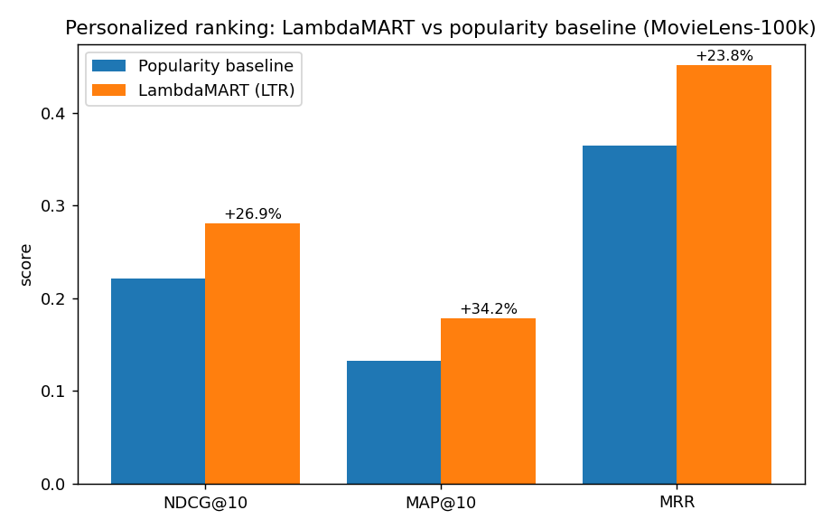

# Learning-to-Rank for Personalized Item Ranking

A compact, reproducible **learning-to-rank** project: rank the items a user will
engage with to the top of their list. This is the same problem shape as **product
search / relevancy ranking on a marketplace** — I built the production version of
this class of system at work; this is a clean public-data demonstration of the
approach.

**Data:** [MovieLens-100k](https://grouplens.org/datasets/movielens/100k/)
(943 users, 1,682 items, 100k interactions).
**Model:** XGBoost `XGBRanker` (LambdaMART, `rank:ndcg`) vs a popularity baseline.

## Results

Evaluated with **popularity-matched hard negatives** (see the note below on why
this matters), averaged over 906 users:

| Metric   | Popularity baseline | LambdaMART (LTR) | Lift |
|----------|--------------------:|-----------------:|-----:|
| NDCG@10  | 0.221 | **0.281** | **+26.9%** |
| MAP@10   | 0.133 | **0.178** | **+34.2%** |
| MRR      | 0.365 | **0.452** | **+23.8%** |



## The interesting part: I found the bug in my own evaluation

My **first** version sampled test negatives *uniformly at random* — and the LTR
model **lost** to the popularity baseline (NDCG −0.7%).

That's a classic recommender-systems trap: random negatives are mostly unpopular,
so **popularity alone separates them from positives almost perfectly** — an
artificially strong, un-beatable baseline. It tells you nothing about
personalization.

The fix is **popularity-matched ("hard") negatives** — sample negatives in
proportion to item popularity, so the candidates are *popular items this user
didn't engage with*. Now popularity can't cheat, and the model's personalization
signals have to do the work. After the fix, LambdaMART beats popularity by ~27%
NDCG, and the importance of the personalization feature (genre affinity) **doubled**
(0.12 → 0.26). Same model — the change was making the evaluation honest.

## What's modeled

- **Task:** per user (= "query"), rank a candidate list of items (= "documents").
- **Relevance:** graded from rating, `max(rating − 3, 0)` (4→1, 5→2, ≤3→0);
  a "positive" is rating ≥ 4.
- **Temporal split, per user:** each user's most recent 20% of interactions → test.
  No future interaction leaks into training.
- **Leakage guard:** every feature (item popularity, item/user mean rating, genre
  affinity) is computed from the **train split only**; cold items/users fall back
  to global means.
- **Features:** `item_pop_log`, `item_mean`, `user_activity`, `user_mean`,
  `genre_match` (dot product of the user's genre-preference vector with the item's
  genre vector).
- **Metrics:** NDCG@10, MAP@10, MRR.

## Run it

```bash
pip install -r requirements.txt
python src/download.py     # fetches MovieLens-100k (~5 MB) into data/
python src/pipeline.py     # trains, evaluates, writes results/
```
Fully reproducible (fixed seed). Runs in well under a minute on a laptop, CPU-only.

## What I'd do next
- Add collaborative-filtering embeddings (matrix factorization / implicit ALS) as
  ranking features — pure content + popularity features leave signal on the table.
- Compare listwise vs pairwise objectives and tune with proper per-user CV.
- Serve top-N with a candidate-generation → ranking two-stage design (how this
  scales in production).

## Layout
```
src/download.py   # fetch dataset
src/pipeline.py   # features (leakage-safe) → train → evaluate → chart
results/          # metrics.json + ranking_comparison.png
```
